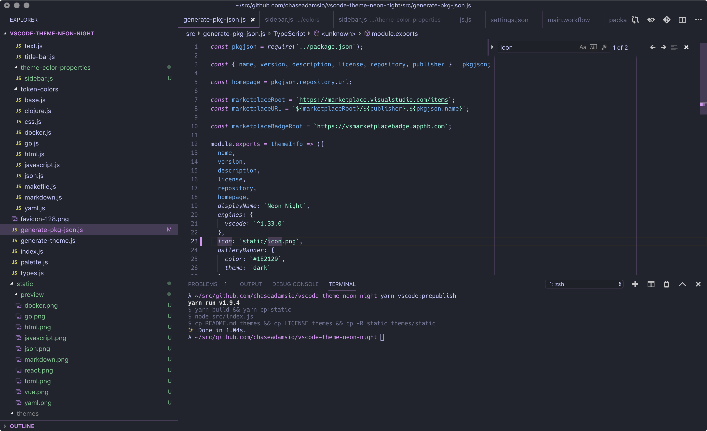
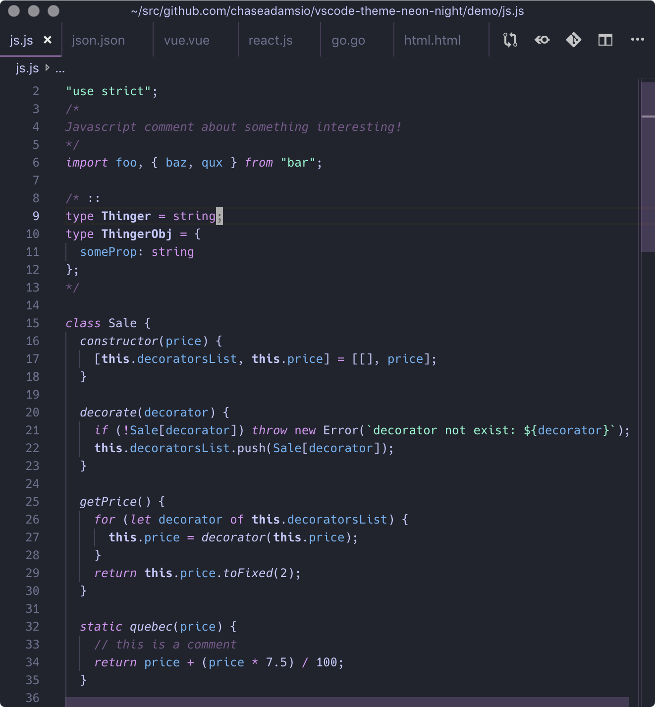
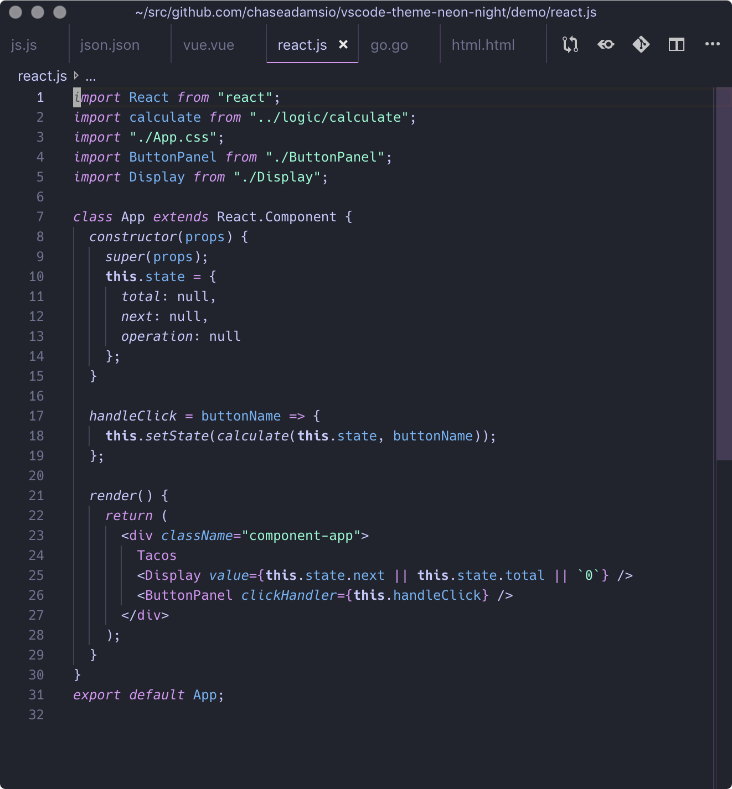
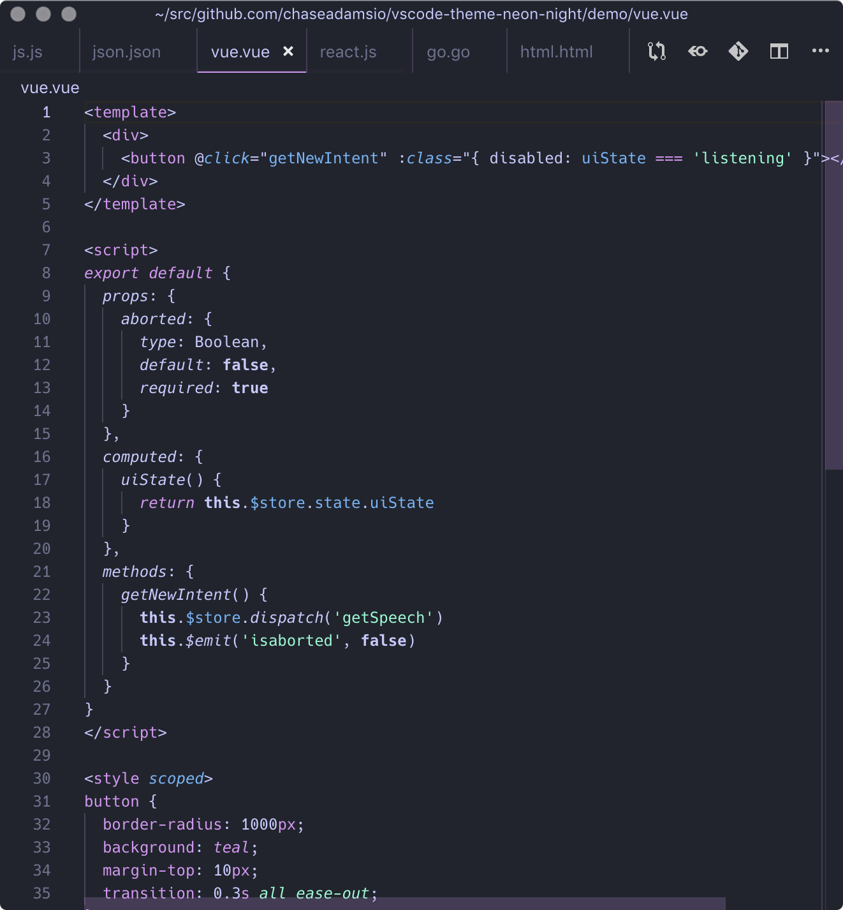
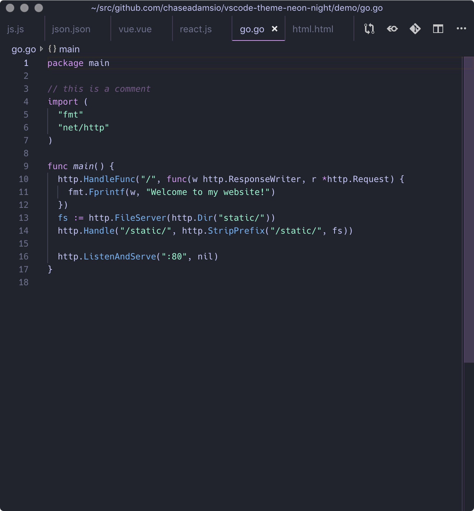
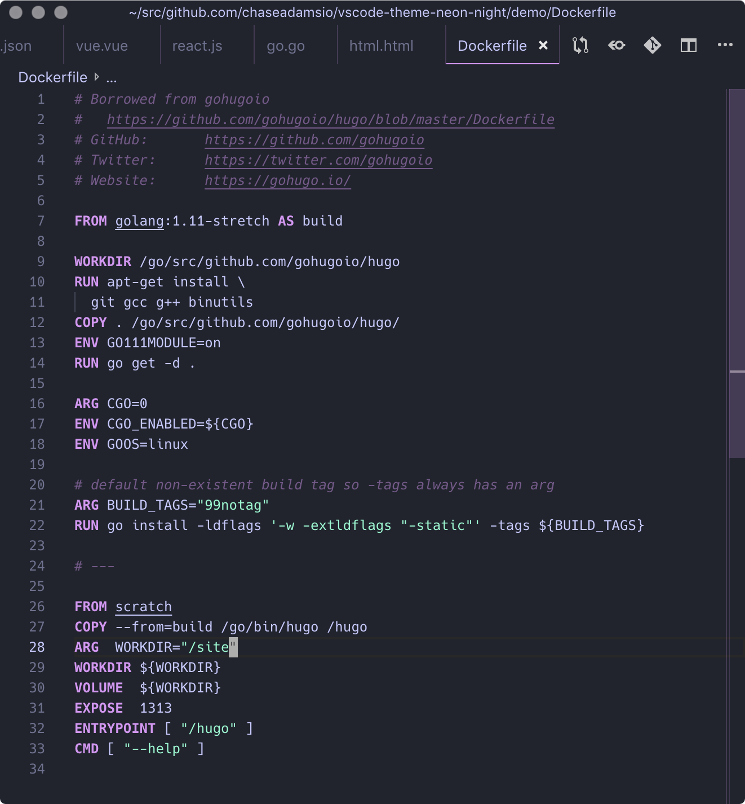
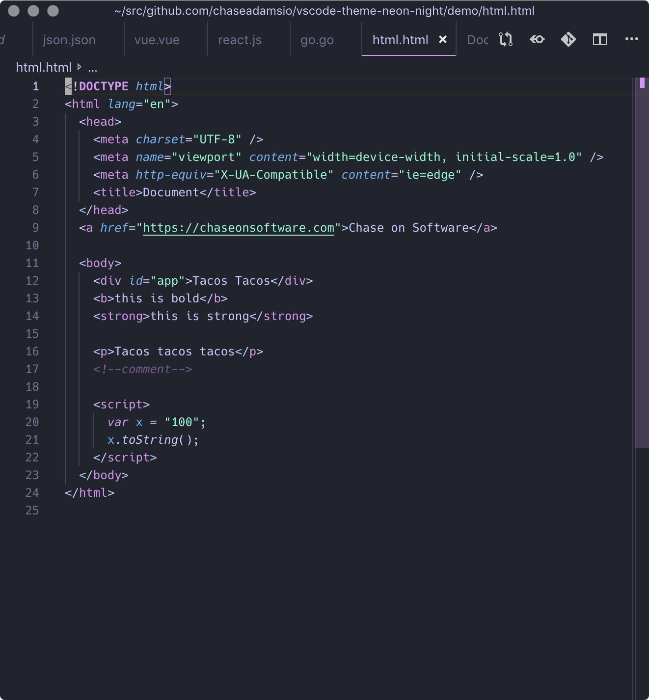
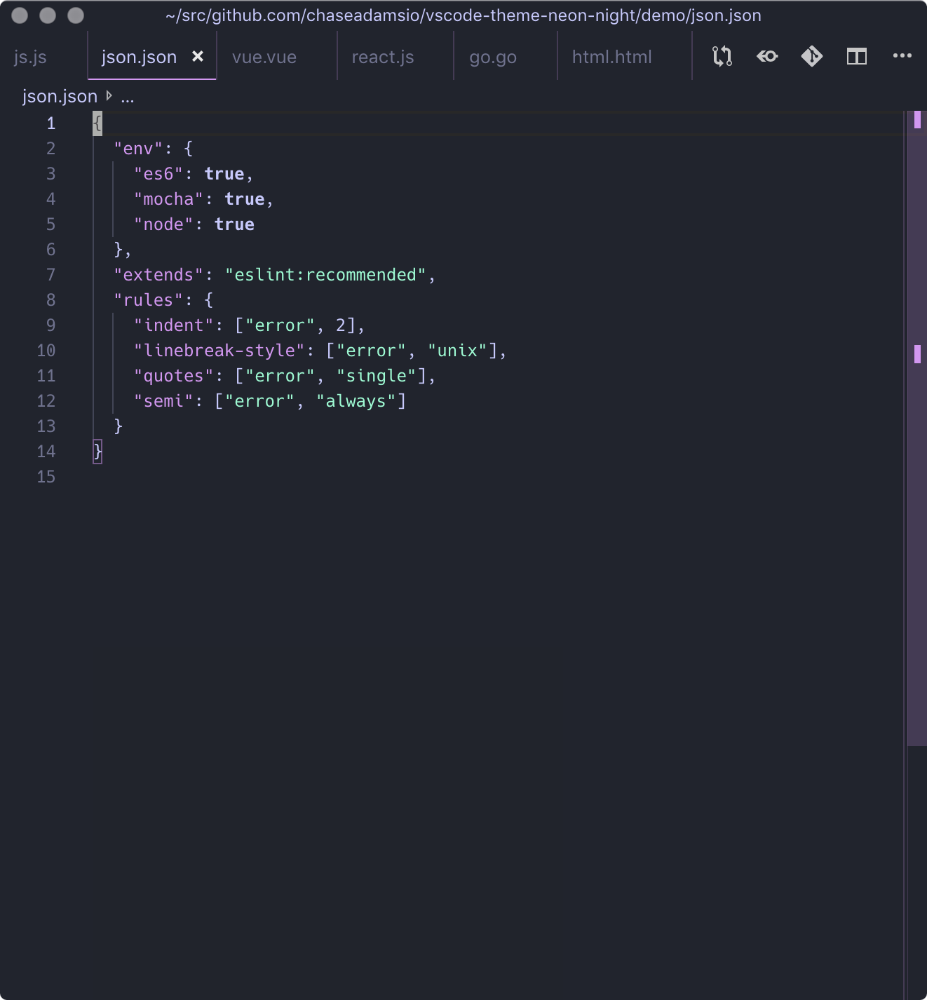
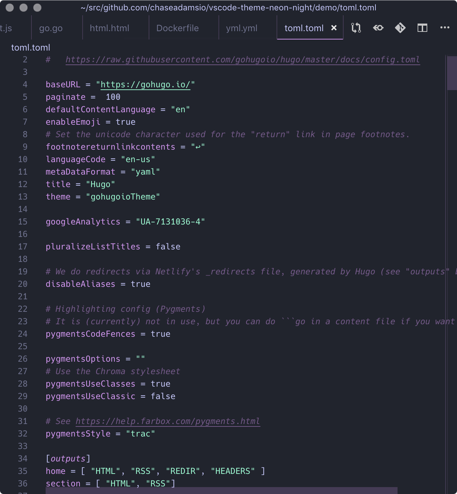
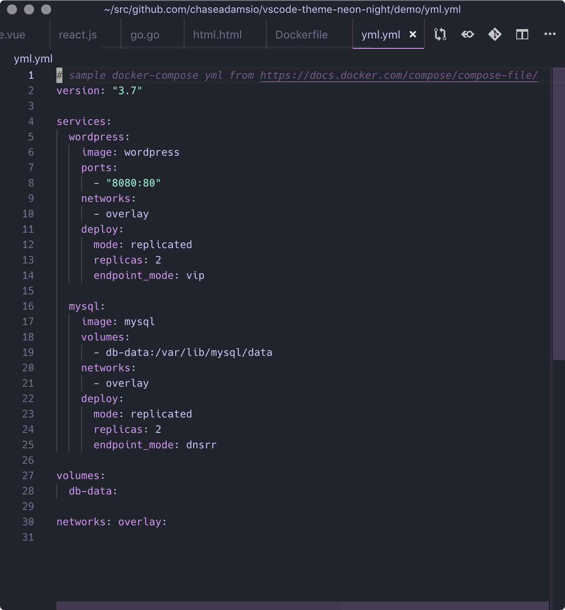

# Neon Night

> A dark theme for VS Code



| JavaScript | React | Vue |
|:---:|:---:|:---:|
|  | |  |

| Go | Dockerfile | HTML |
|:---:|:---:|:---:|
|  |  |  |

| JSON | TOML | YAML |
|:---:|:---:|:---:|
|  |  | 


## Getting Started

You can find the Neon Night theme in the [Visual Studio Code Marketplace](https://marketplhub.visualstudio.com/items?itemName=chaseadamsio.vscode-theme-neon-night).

## Installation

1. Open the **Extensions** sidebar in VS Code. `View → Extensions`
2. Search for `Neon Night`, choose "Neon Night" by **chaseadamsio**
3. Click **Install** to install it
4. Click **Reload** to reload VS Code
5. From the menu bar click: Code > Preferences > Color Theme > **Neon Night** (or any of the variants listed)
6. 🎉🎉 Enjoy!

## Syntax Colors

|      USAGE       |                                HEX CODES                                 |
| ---------------- | ------------------------------------------------------------------------ |
| Background       |  `#20242d`       |
| Background Dark  |  `#1B1E26`       |
| Foreground       |  `#C7C8FF`       |
| Black       |  `#20242d`       |
| White       |  `#C7C8FF`       |
| Magenta         |  `#DD92F6`       |
| Blue         |  `#69B4F9`       |
| Cyan        |  `#8CE8ff`       |
| Green        |  `#7EFDD0`       |
| Red        |  `#FF8E8E`       |
| Yellow        |  `#FCAD3F`       |
| Diff Added       |  `#7EFDD011` |
| Diff Removed     |  `#FF8E8E11` |

## Development

Run the `develop:init` task:

```sh
yarn develop:init
```

This will create a symlink in the VS Code extensions and build the theme for the first time. Afte running this, follow the Installation instructions to load the theme.

## Publishing

- **`vscode:prepublish`** - Creates the `neon-night.json` and `package.json` in `<ROOT>/themes` and copies relevant files (README, license, static assets)
- **`vscode:publish`** - Publishes `themes` as the root directory for the extension.

Designed with 💜 by **[Chase Adams](https://github.com/chaseadamsio)**. You can find me on [Twitter at chaseadamsio](https://twitter.com/chaseadamsio).
